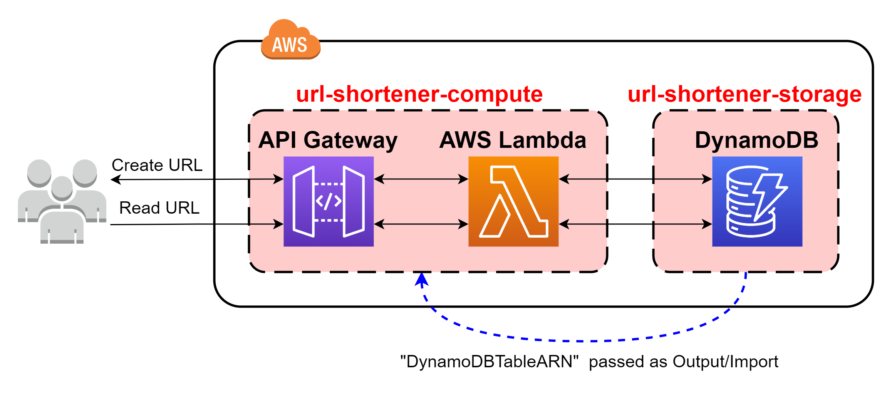

# :scissors: URL Shortener Architecture :scissors:

  

This is a simple custom `URL-shortener` project deployed on AWS with the following specifications:

- Infrastructure as Code with [AWS CDK](https://aws.amazon.com/cdk/)
- Source Code with [AWS Lambda Functions](https://aws.amazon.com/lambda/) built with [Python Runtime](https://www.python.org)
- Unit Tests with [Python Unittest Framework](https://docs.python.org/3/library/unittest.html)
- Integration Tests: TODO
- Deployment Strategies: TODO

This project was inspired by the following tutorials and examples:

- [Infrastructure is Code with the AWS CDK - AWS Online Tech Talks](https://youtu.be/ZWCvNFUN-sU)
- [Werner Vogels on the AWS Cloud Development Kit (AWS CDK)](https://youtu.be/AYYTrDaEwLs)

The information of this repository is based on many online resources, so feel free to use it as a guide for your future projects!.  

## AWS CDK :cloud:

[AWS Cloud Development Kit](https://aws.amazon.com/cdk/) is an amazing open-source software development framework to programmatically define cloud-based applications with familiar languages.  

My personal opinion is that you should learn about CDK when you feel comfortable with cloud-based solutions with IaC on top of [AWS Cloudformation](https://aws.amazon.com/cloudformation/). At that moment, I suggest that if you need to enhance your architectures, it's a good moment to use these advanced approaches.  

The best way to start is from the [Official AWS Cloud Development Kit (AWS CDK) v2 Documentation](https://docs.aws.amazon.com/cdk/v2/guide/home.html).  

## Dependencies :vertical_traffic_light:

The dependencies are explained in detail for each project, but the most important ones are Python and AWS-CDK.  

My advice is to primary understand the basics on how CDK works, and then, develop amazing projects with this incredible AWS tool!.  

### Software dependencies (based on project)

- [Visual Studio Code](https://code.visualstudio.com/)  
  Visual Studio Code is my main code editor for high-level programming. This is not absolutely necessary, but from my experience, it gives us a great performance and we can link it with Git and GitHub easily.  

- [NodeJs](https://nodejs.org/en/)  
  NodeJs is a JavaScript runtime built on Chrome's V8 JavaScript engine programming language. The community is amazing and lets us handle async functionalities in elegant ways.  

- [Python](https://www.python.org/)  
  Python is an amazing dynamic programming language that let us work fast, with easy and powerful integration of different software solutions.  

### Libraries and Package dependencies (based on project)

- [CDK CLI (Toolkit)](https://docs.aws.amazon.com/cdk/v2/guide/cli.html)  
  To work with the CDK, it is important to install the main toolkit as a NodeJs global dependency. Then, feel free to install the specific language AWS-CDK library (for example: [aws-cdk.core](https://pypi.org/project/aws-cdk.core/).  

## Usage :dizzy:

All projects are well commented/documented and most of them have specifications and remarks for their purpose and I/O.  

I will be uploading most of the files, and try to keep it as clean as possible.  

## Special thanks :gift:

- Thanks to all contributors of the great OpenSource projects that I am using.  

## Author :musical_keyboard:

### Santiago Garcia Arango

<table border="1">
    <tr>
        <td>
            
Senior DevOps Engineer passionate about advanced cloud-based solutions and deployments in AWS. I am convinced that today's greatest challenges must be solved by people that love what they do.

        </td>
        <td>
            

        </td>
    </tr>
</table>
